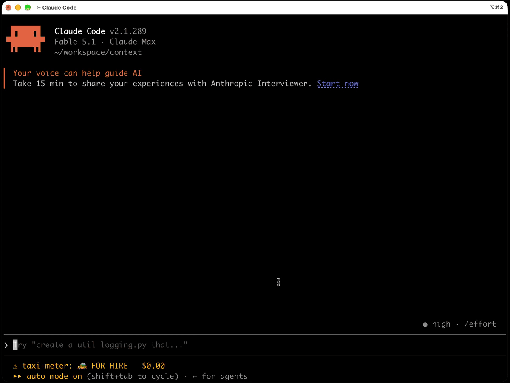

# 🚕 Claude Taxi Meter

**English** | [简体中文](README.zh-CN.md)

A taxi meter for Claude Code. Every token Claude burns makes the fare in your status line jump: $0.03… $0.47… $2.18. Watching it tick does more for cost awareness than any dashboard.



## Install

In Claude Code:

```
/plugin marketplace add gxcsoccer/claude-taxi-meter
/plugin install taxi-meter@claude-taxi-meter
```

The meter starts in your next session (or right away after `/reload-plugins`). Try `/taxi demo` to see a ride without spending anything.

> Requires a recent Claude Code: the meter is a **mod**, built on Claude Code's function-hooks plugin API, which is in early access. It was built and tested on 2.1.289.

## What you get

**A live meter in the status line**

```
🚕 FOR HIRE   $1.20                                  ← idle
🚖 HIRED●   $1.27 ▲0.03 · trip $0.07 · 🔥$0.42/min   ← Claude is writing
🚕 WAITING⏳   $1.31 · trip $0.11 · Bash              ← a tool is running
🚕 FOR HIRE   $1.34 · last $0.14                     ← ride over
```

- **Ticks as tokens stream**, then settles on the session's real total, the same number `/cost` shows.
- **Ka-ching** 💸 at $0.50, $1, $2, $5, $10… with a toast and a cash-register sound.
- **A receipt toast** 🧾 after any turn that costs $0.50 or more.

**A meter pane** (`/taxi meter`): big LED digits, ride timer, burn rate, budget bar, a 30-minute spend sparkline and your recent rides, with hotkey buttons.

**A budget** (`/taxi budget 5`): the status line shows `budget 49%`, then `⚠️ budget 84%`, then `🛑 OVER BUDGET`, with warnings at 80% and 100%. It warns; it never blocks you.

**Payback mode for subscribers** (`/taxi plan 200`): on a Pro or Max plan, per-token cost doesn't hurt, so the meter flips the story and shows how many times over this month's usage pays back your plan: `💎 3.2× plan`, with a 🎉 at 1×, 2×, 3×, 5×, 10×… Subscribers are detected automatically and get a one-time hint.

**Receipts to share**: `/taxi` prints a receipt card (rides, jumps, priciest prompt, lifetime total, and what the money would buy in lattes). `/taxi share` copies a short summary to your clipboard.

## Commands

| Command | What it does |
| --- | --- |
| `/taxi` | Print the receipt |
| `/taxi meter` | Open the live meter pane |
| `/taxi demo` | A pretend 14-second ride, for trying it out or recording a GIF. Nothing is billed or recorded |
| `/taxi share` | Copy a ride summary to the clipboard |
| `/taxi plan 200` | Set your subscription's monthly price (USD) to see payback; `off` clears it |
| `/taxi budget 5` | Set this session's fare limit (USD); `off` clears it |
| `/taxi usd` · `cny` | Switch currency |
| `/taxi en` · `zh` | Switch language |
| `/taxi hide` · `show` | Hide or show the status line meter |

`/taxi` runs immediately, even while Claude is still working.

## Options

Set them in `/config`, or under `pluginConfigs["taxi-meter"].options` in `settings.json`.

| Option | Default | |
| --- | --- | --- |
| `language` | `en` | `en` (FOR HIRE / HIRED / WAITING) or `zh` (空车 / 载客 / 等候) |
| `currency` | `USD` | `USD` or `CNY` |
| `cnyRate` | `7.1` | CNY per USD |
| `sound` | `true` | Ka-ching at milestones (macOS) |
| `bigTripUsd` | `0.5` | Toast a receipt for turns at least this expensive |
| `budgetUsd` | `0` | Default fare limit per session; 0 for none |
| `planUsd` | `0` | Subscription price per month; turns on payback mode. 0 for API billing |

## How it works

Claude Code **mods** are plugins that run inside Claude Code itself, hooked into its events. The meter uses a handful:

| Hook | What the meter does with it |
| --- | --- |
| `turn.step` | Reads Claude's output as it streams and estimates the fare live: about 4 characters per token at the model's output price. Silent thinking is billed by time, like a cab stuck in traffic |
| `session.measure` | Settles on the session's real cost, the figure `/cost` shows |
| `ui.status` | Draws the meter in the status line |
| `ui.render` | Draws the meter pane and the receipt card |
| `command.run` | Answers `/taxi` |

The live estimate only fills the gap while a response is streaming. The total always lands on the real number.

## FAQ

**Is the fare accurate?** The total is: it is the session's own cost ledger. Only the ticking in between responses is an estimate.

**What's the ⚠ before the meter?** That's how Claude Code currently shows a plugin's status entry next to its own notices. The meter isn't reporting a problem.

**I'm on a subscription. Is this money I'm paying?** No. The fare is what the same usage would cost at API prices. Set `/taxi plan` to see it as payback instead.

**Does `/taxi demo` cost anything?** No. It's a scripted animation: nothing is billed, and your rides, totals and milestones are left untouched.

## Development

```sh
claude --plugin-dir /path/to/claude-taxi-meter   # run from a checkout
claude plugin validate . && claude plugin test .  # check and test
```

To update an installed copy: `claude plugin marketplace update claude-taxi-meter && claude plugin update taxi-meter@claude-taxi-meter`.

## License

[MIT](LICENSE)
